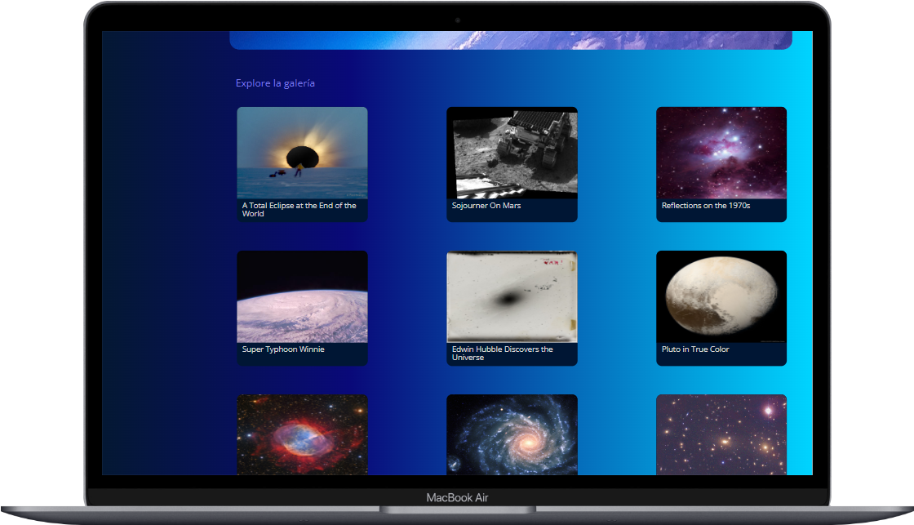
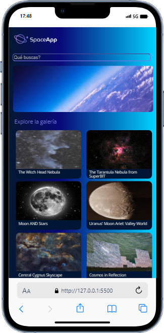

# SpaceApp - JavaScript: consumiendo y manejando datos de APOD (API de la Nasa)

#### 

     
     
     
    

  

#### ¡Bienvenido al proyecto!
---

### Repositorio APOD: https://github.com/nasa/apod-api
### Web: https://api.nasa.gov 
### En este proyecto consumo y manipulo datos de la API APOD para poner en practica el aprendizaje del curso de ALURA LATAM - One Oracle Next Education
### Usando Síncrono y asíncrono en Javascript
### Callbacks y Callback Hell
### Usando promises
